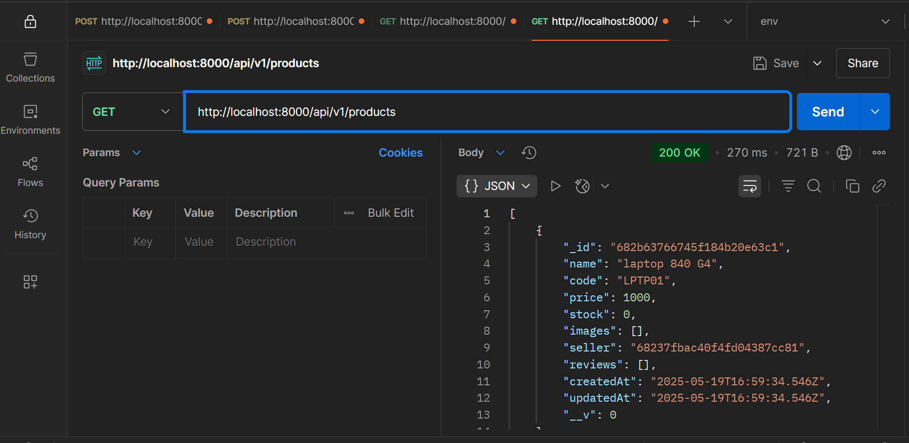
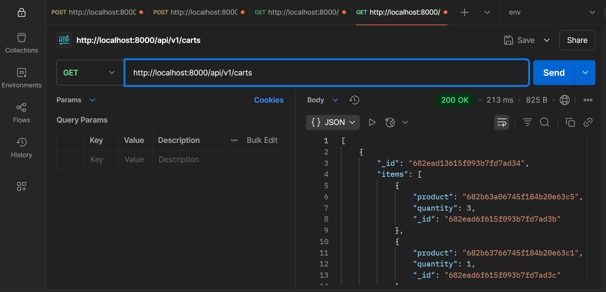
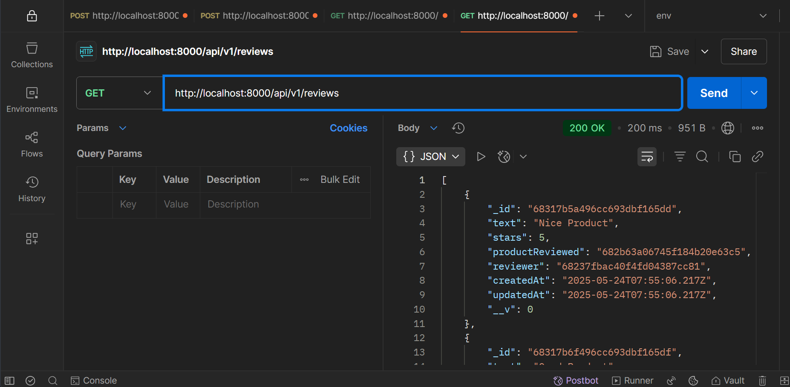
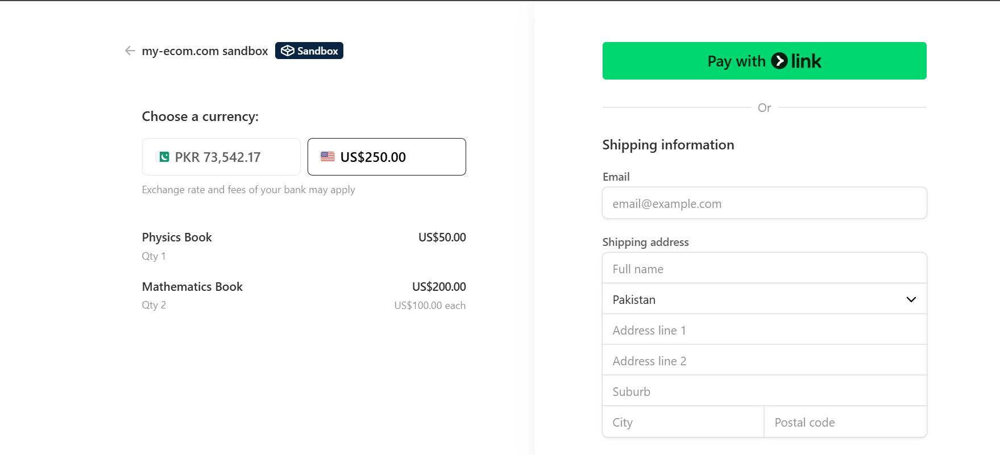

# 🚀 E-commerce API

A comprehensive RESTful API for e-commerce applications built with Node.js, Express, MongoDB, and Stripe integration.

## 🛠️ Tech Stack

- **Backend**: Node.js, Express.js
- **Database**: MongoDB with Mongoose ODM
- **Payment**: Stripe API
- **Authentication**: JWT (JSON Web Tokens)

## 🖼️ Screenshots






## ✨ Features

- **Authentication & Authorization** - Secure user registration, login, and JWT-based authentication
- **User Management** - Complete user profile CRUD operations
- **Product Management** - Full product catalog with CRUD functionality
- **Shopping Cart** - Add, update, and remove items from cart
- **Payment Processing** - Secure payment handling with Stripe integration
- **Review System** - Product reviews and ratings with CRUD operations

## Prerequisites

Before running this application, make sure you have the following installed:

- Node.js (v14 or higher)
- MongoDB
- npm or yarn

## Installation

1. Clone the repository:

```bash
git clone https://github.com/Developer-Bilal/ecommerce-api.git
cd ecommerce-api
```

2. Install dependencies:

```bash
npm install
```

3. Create a `.env` file in the root directory and add the following environment variables:

```env
PORT=
MONGO_URI =
JWT_SECRET=
STRIPE_API_SECRET=
BASE_URL=
```

4. Start the application:

```bash
# Development mode
npm run dev

# Production mode
npm start
```

## Security Features

- Password hashing with bcrypt
- JWT token-based authentication
- CORS configuration

## 📧 Contact

If you have any questions or suggestions, feel free to reach out:

- Email: developer.bilal.channa@gmail.com ✉️
- LinkedIn: [Profile](https://www.linkedin.com/in/Engineer-Bilal-Channa) 💼
